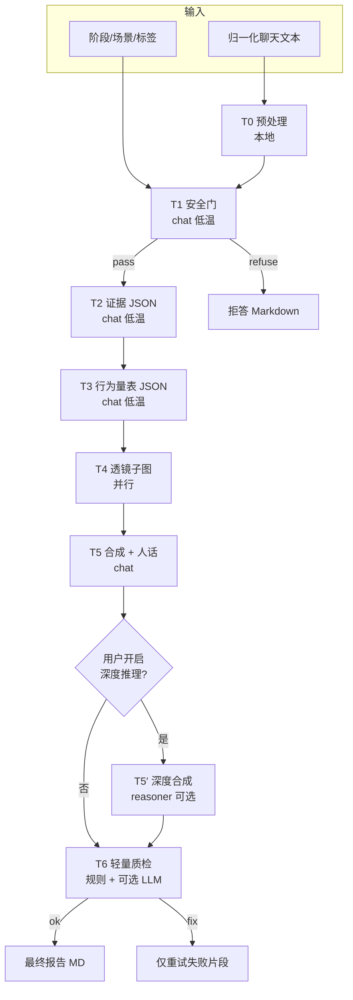

# 报告生成：多步流水线 · 深度推理计费 · 上下文缓存 — 标杆技术方案（已定稿取向）

> **文档性质**：实施级技术方案（非读后即弃的综述）。  
> **你已确认的决策**：① 报告由「单次大生成」改为「多步流水线」；② 「深度推理（DeepSeek `deepseek-reasoner`）」作为**用户可选**，并与**配额/计费**挂钩；③ 投入 **DeepSeek 官方上下文缓存** POC，并纳入观测与验收。  
> **接口基线**：DeepSeek 与 OpenAI 兼容的 Chat Completions（[`https://api.deepseek.com/zh-cn/`](https://api-docs.deepseek.com/zh-cn/)），现有 `openai` SDK 可延续。  
> **上下文缓存官方说明**：[Context Caching（磁盘 KV 前缀匹配）](https://api-docs.deepseek.com/guides/kv_cache)。

---

## 1. 「标杆作品」的验收定义

从**个人第一个 Agent 作品**升级为可对外展示的标杆，建议用可度量的门槛自洽，而不是主观「感觉更智能」。

| 维度 | 标杆标准（建议最低线） |
|------|------------------------|
| **结构** | 最终 Markdown 仍满足产品约定的章节顺序与禁区（心动区间、无伪精确百分比等）；机器可解析的中间态（JSON）可存档、可回归。 |
| **成本** | 每份报告记录 **分阶段 token** 与 **`prompt_cache_hit_tokens` / `prompt_cache_miss_tokens`**；P95 成本相对当前单次超长 Prompt 可说明.optimization |
| **幻觉治理** | 关键断言可追溯到「证据 id / 原文片段」或显式「无直接证据」；质检节点可自动拦截一类违规。 |
| **可靠性** | 单步失败可重试该步；禁止因一步超时而整份报告静默失败（需状态与错误码）。 |
| **产品 honesty** | 「深度推理」开启时，用户明确知晓**额外耗时 + 额外扣次/加价**；关闭时路径可预测。 |

---

## 2. 最优技术栈组合（结论）

| 层级 | 选型 | 理由 |
|------|------|------|
| **编排** | **LangGraph** | 多步流水线 = 有状态图；步骤级日志、重试、并行（多透镜）、未来「人在环」扩展最省力。 |
| **结构化 I/O** | **Pydantic v2 + Instructor**（或等价：强制 JSON Schema 解析） | 「抽取 / 量表」若靠纯 Markdown，难以做标杆级校验与 CI 回归。 |
| **LLM 调用** | **OpenAI Python SDK** 直连 DeepSeek `base_url` | 依赖薄、可控；不强行 LangChain 包一切。 |
| **LangChain** | **可选** | 仅在需要现成的 Message、少量 Tool 抽象时局部引入；**不作为**主干。 |

这不是「堆框架」，而是：**图编排解决复杂度，Pydantic 解决正确性薄层，SDK 解决调用面**。

---

## 3. 目标架构总览

### 3.1 数据流（逻辑）

### 3.2 与当前代码的对应关系

| 当前 | 演进 |
|------|------|
| `prompt_builder.build_system_and_user_prompts` 一次拼全 lens + 全文 | 拆为：**全局短 system** + **按节点注入的 lens 压缩块** + **T2 后只传结构化中间态** |
| `DeepSeekClient.chat` 单次返回字符串 | 扩展为：**`chat` 返回 content + `usage`（含缓存字段）**；部分步骤 **`response_format` / JSON 约束**（以 DeepSeek 当时支持为准） |
| `analyze_archive` 一次性 `llm_client.chat` | 改为调用 **LangGraph 编译后的 graph.invoke**，持久化 `run_id`、每步 usage |

---

## 4. 流水线阶段规格（最优解细化）

### T0 — 预处理（零 LLM）

- 分段、脱敏占位、**硬上限**（超长则保留头尾 + 中间摘要占位，摘要留给 T2 之前可由一步「压缩」或并入 T2 的输入策略）。
- 输出：`normalized_chunks` 或单一 `working_text` + 统计（长度、说话人数量等）。

### T1 — 安全与边界

- 模型：`deepseek-chat`，`temperature ≤ 0.2`。
- 输出：结构化 `{"decision": "pass"|"refuse", "reason_code", "user_message_md"}`。
- **refuse 则立即返回**，不再扣「深度推理」类附加费用（若实现分项计费）。

### T2 — 证据卡片（强制结构化）

- 模型：`deepseek-chat`，低温。
- 输出：`EvidenceItem[]`（Pydantic）：`id`, `quote`, `span_hint`, `lens_tags`, `confidence`, `notes`。
- **规则**：任何后续「事实性判断」在文中应能对应 `id` 或声明无证据。

### T3 — 行为量表（强制结构化）

- 输入：T2 + **压缩后的 rubric 锚点**（把长 `score_rubric.md` 压成「评分锚点表」进 Prompt，全文不必重复出现在下游）。

### T4 — 透镜子图（并行）

- **每个透镜一个节点**；输入仅为：与本透镜相关的 evidence 子集 + T3 摘要字段。
- **门控**：星座透镜无标签则 **skip**（图中条件边）。
- 每节点输出：`lens_id`, `body_md`, `bullets_for_synthesis[]`, `conflict_flags[]`。

### T5 — 合成与人话层（默认）

- 模型：`deepseek-chat`，中低温。
- 输入：各透镜 `bullets_for_synthesis` + `conflict_flags`，**不附全量原始聊天**（除非极短校验抽样）。
- 产出：符合产品标题结构的 Markdown 主干。

### T5′ — 深度推理（用户可选）

- 模型：**`deepseek-reasoner`**（与官方文档一致：`deepseek-chat` / `deepseek-reasoner` 分工不同）。
- **仅用于**：冲突重、或用户显式开启时的「合成 / 冲突调解」段落；**设 `max_tokens` 与每报告最多调用次数（建议默认 1）**。
- 输出合并策略：只替换「合成 / 一眼看懂」相关章节，或生成 `patch` 由程序拼回（利于 diff 与回放）。

### T6 — 轻量质检

- **规则引擎**：禁用伪精确百分比、档位与区间一致性等（与现有 Prompt 约束对齐）。
- **可选 LLM**：极短「只列矛盾句，不重写全文」；失败则 **只重试 T5/T5′ 对应块**。

---

## 5. 深度推理：产品开关 + 计费「最优解」

目标：用户心智简单、实现不爆库表、与现有 **「次数」体系**一致。

### 5.1 推荐：**复合扣次（主方案）**

- **基准路径**：每次「生成报告」仍消耗 **1 次** `credits`（与现网 `consume_credit_for_analyze` 语义一致）。
- **若开启「深度推理」**：在同一次请求中 **额外再扣 `DEEP_REASON_EXTRA_CREDITS`（建议默认 1）**；若余额不足，HTTP **402** 并文案说明「需 N 次」。

优点：不新增「 Reasoner 币 」概念；卡密仍发「次数包」即可。

### 5.2 请求与 API

- `AnalyzeRequest` 增加：`deep_reasoning: bool = False`。
- 服务端顺序：**先计算总需次数 → 再原子扣减**（单次事务：`1 + (1 if deep_reasoning else 0)`），避免只扣基础次数后 reasoner 失败导致不公平（若 reasoner 失败，需定义是否回滚附加次数 —— 标杆做法：**仅在实际发起 reasoner 成功前扣附加**，或**全失败则回滚整笔**）。

### 5.3 前端

- 明确 Toggle：「深度推理（更耗时，多扣 X 次）」。
- 展示预计：可选读取后端 `GET /api/.../pricing` 或写死配置，保持透明。

---

## 6. DeepSeek 上下文缓存：POC 与「最优 Prompt 形态」

官方机制要点（摘自 [Context Caching 文档](https://api-docs.deepseek.com/guides/kv_cache)）：

- **默认开启**，利用**前缀一致**的请求复用磁盘缓存；**仅重复前缀部分计为 cache hit**。
- 响应 `usage` 中含：**`prompt_cache_hit_tokens`**、**`prompt_cache_miss_tokens`**（用于核算与 POC 验收）。
- **注意**：缓存按 **64 token** 为存储单元，过短前缀收益有限；**best-effort**，不保证 100% 命中；缓存可能数小时至数天后清除。

### 6.1 POC 目标

1. **`llm_client` 解析并记录**上述两个字段 + 常规 `prompt_tokens` / `completion_tokens`（落库或结构化日志）。  
2. **多步流水线稳定前缀**：  
   - **system**：短身份 + 安全总则 + `reference` 极短版（过长则哈希版 + 版本号）。  
   - **首条 user**：若多轮在同一会话内模拟，保持**不变的技能前缀**在前，**每条请求只在末尾追加「本步任务 + 本步可变输入」**。  
3. **对比实验**（同一批真实归档）：  
   - **旧**：单次大 Prompt；  
   - **新**：流水线多步，但**故意**让前几步共享同一 system + 公共前缀，观察 `prompt_cache_hit_tokens` 是否显著上升。

### 6.2 反模式（减少命中）

- 在 system/user 前缀里夹 **时间戳、随机 id、全量聊天** → 前缀抖动 → 缓存失效。  
- 多步请求间 **消息角色顺序不一致**、或中途插入无关 assistant 文本 → 前缀分叉。

---

## 7. Token 与质量：预算表（实施时填数）

建议在代码中设 **软预算**（仅告警）与 **硬上限**（截断/降级）：

| 步骤 | 模型（默认） | 温度上限 | 备注 |
|------|----------------|----------|------|
| T1 | chat | 0.2 | 极短输出 |
| T2–T3 | chat | 0.2 | JSON 优先 |
| T4 | chat | 0.25–0.35 | 可按透镜微调 |
| T5 | chat | 0.3–0.4 | |
| T5′ | reasoner | 由官方建议 | 用户可选、限次 |
| T6 | chat / 无 | — | 能规则则规则 |

**观测**：每步打 `span`（OpenTelemetry 或 structlog），字段：`run_id, archive_id, step, model, usage.*`。

---

## 8. 防幻觉：标杆级工程清单（必须项 + 加分项）

**必须项**

1. T2/T3 **结构化先行**，叙事仅能引用已有 `evidence id`。  
2. 禁止在无 quote 时输出确定性的「她的心理是…」类论断（模板约束 + T6 扫描）。  
3. **心动档位 / 区间 / 正文**一致性校验（规则）。

**加分项**

- 对最终 MD 做「抽取断言 → 回看 evidence 表」的自动对账（浅层 NLP 或二次 LLM，成本控制启用）。  
- 黄金样本集（10–30 份脱敏对话）做回归：结构字段齐全率、违禁字符串率。

---

## 9. 实施路线图（建议顺序）

| 阶段 | 交付 | 标杆含义 |
|------|------|----------|
| **M0** | `usage` + 缓存字段入库 / 日志；`AnalyzeRequest.deep_reasoning` + **双重扣次** | 可证明「省钱了吗」 |
| **M1** | T1–T2–T3 结构化 + 末段仍拼 Markdown（弱化单步大 Prompt） | 正确性薄层落地 |
| **M2** | LangGraph 全图 + T4 并行 + T6 质检重试 | 架构到达「作品级」 |
| **M3** | T5′ reasoner 与冲突门控 + 前端开关 copy 完善 | 产品差异化 |
| **M4** | 缓存 POC 报告（同前缀命中率对比 + 单价测算） | 对外叙事 / 博客素材 |

---

## 10. 风险与对策

| 风险 | 对策 |
|------|------|
| 延迟上升 | T4 并行；异步任务 + SSE/轮询；首屏先返回「一眼看懂」骨架（可选）。 |
| Reasoner 成本高 | 默认关闭 + 强扣次 + 每报告调用上限。 |
| JSON 偶发损坏 | Instructor 重试 + 降温度；失败降级为「缩小 schema 再请求一次」。 |
| 缓存不达预期 | 不依赖缓存做正确性；仅作成本优化；日志持续调前缀结构。 |

---

## 11. 附录：环境变量建议（新增）

| 变量 | 含义 |
|------|------|
| `DEEP_REASON_EXTRA_CREDITS` | 开启深度推理时额外扣除次数，默认 `1` |
| `DEEP_REASON_MAX_CALLS_PER_RUN` | 单次报告 reasoner 最多调用次数（**待实现** env 门控） |
| `OPENAI_MODEL` / `DEEPSEEK_MODEL` | 默认 chat 模型 |
| `DEEPSEEK_REASONER_MODEL` | 建议显式 `deepseek-reasoner` |

---

## 12. 实现落地（graph-v1，与本仓库同步）

| 项 | 状态 |
|----|------|
| LangGraph 编排 | `backend/app/pipeline/report_graph.py`：`build → base →（条件）reasoner \| finalize` |
| 用量与缓存字段 | `CompletionUsage` 解析 `prompt_cache_hit_tokens` / `prompt_cache_miss_tokens`；`llm_usage_log` 表 + `AnalyzeResult.usage_steps` |
| 深度推理 | `AnalyzeRequest.deep_reasoning`；`deepseek-reasoner` 整稿再审；失败回退基础稿并 **退还附加次数** |
| 扣次 | 开启深度时一次性扣 `1 + DEEP_REASON_EXTRA_CREDITS`；整次 pipeline 异常 **全额退还**；仅 reasoner 失败 **退附加** |
| 前端 | `NSwitch` + 扣次说明；`GET /api/config/analyze` |
| 扩展设计 | `docs/PIPELINE实现与扩展设计.md`（M1 结构化子图、并行透镜、T6 质检） |

---

## 13. 小结

**最优解**不是再写更长的 Prompt，而是：**用 LangGraph 把「正确性步骤」和「文采步骤」拆开；用 Pydantic 把证据与量表锁死；用可选 reasoner 只做最值得付费的那一段推理；用官方前缀缓存吃透你重复最多的 skills 前缀，并用 `prompt_cache_hit_tokens` 证明收益。**  

按本文从 M0 推到 M4，你的第一个 Agent 作品在**工程质量、成本意识与反幻觉**三条线上都能站得住，适合作为个人标杆与开源背书。

---

*文档版本：v1.1 · 已同步 graph-v1 代码落地；可随实现迭代增补「实际命中率报表」与「黄金集回归结果」。*
